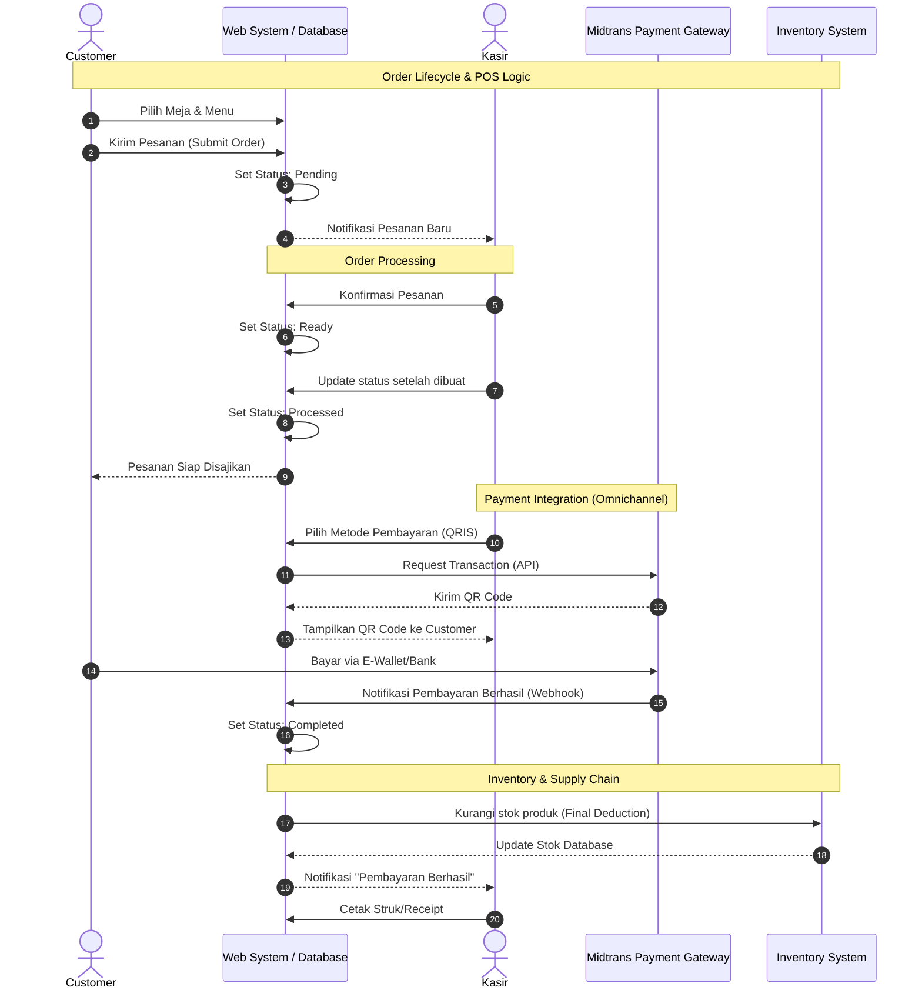

# Business Core Sequence Diagram

```mermaid
sequenceDiagram
    autonumber
    actor Customer
    participant System as Web System / Database
    actor Kasir
    participant Midtrans as Midtrans Payment Gateway
    participant Inventory as Inventory System

    Note over Customer, Inventory: Order Lifecycle & POS Logic
    Customer->>System: Pilih Meja & Menu
    Customer->>System: Kirim Pesanan (Submit Order)
    System->>System: Set Status: Pending
    System-->>Kasir: Notifikasi Pesanan Baru

    Note over Kasir, System: Order Processing
    Kasir->>System: Konfirmasi Pesanan
    System->>System: Set Status: Ready
    Kasir->>System: Update status setelah dibuat
    System->>System: Set Status: Processed
    System-->>Customer: Pesanan Siap Disajikan

    Note over Kasir, Midtrans: Payment Integration (Omnichannel)
    Kasir->>System: Pilih Metode Pembayaran (QRIS)
    System->>Midtrans: Request Transaction (API)
    Midtrans-->>System: Kirim QR Code
    System-->>Kasir: Tampilkan QR Code ke Customer
    Customer->>Midtrans: Bayar via E-Wallet/Bank
    Midtrans->>System: Notifikasi Pembayaran Berhasil (Webhook)
    System->>System: Set Status: Completed

    Note over System, Inventory: Inventory & Supply Chain
    System->>Inventory: Kurangi stok produk (Final Deduction)
    Inventory-->>System: Update Stok Database
    System-->>Kasir: Notifikasi "Pembayaran Berhasil"
    Kasir->>System: Cetak Struk/Receipt
```
