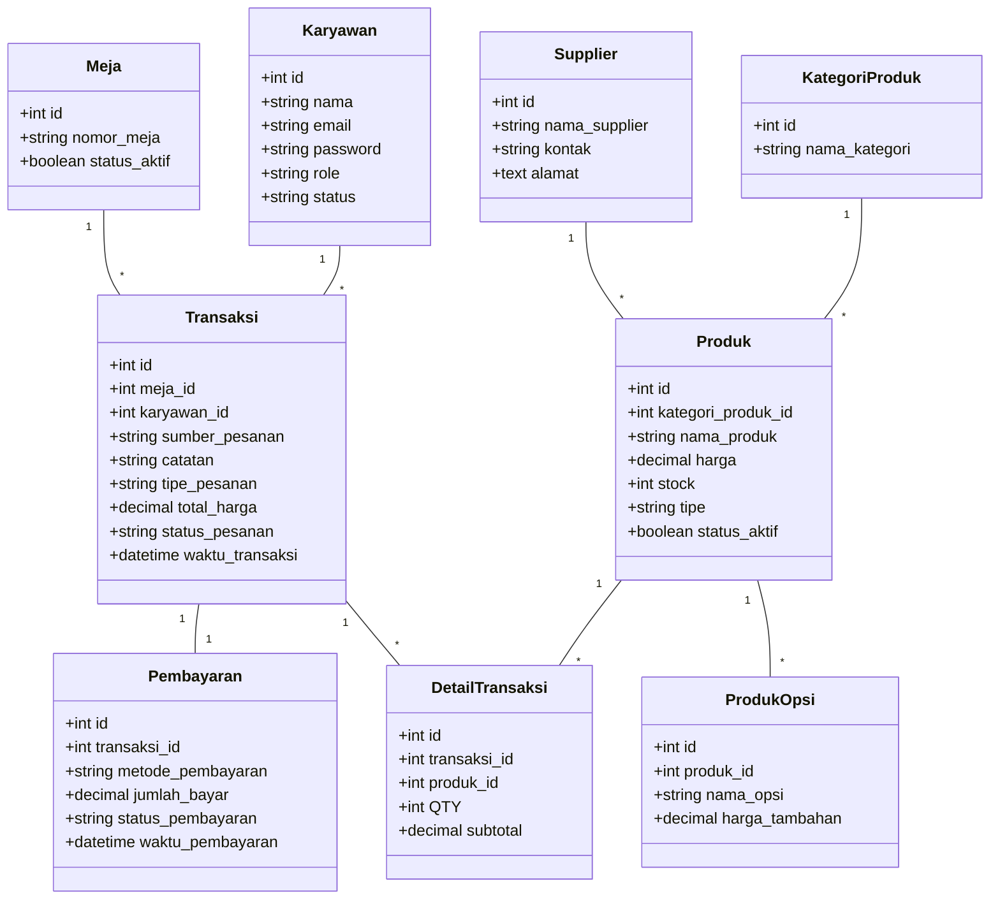

# Database Schema

```mermaid
classDiagram
    class Karyawan {
        +int id
        +string nama
        +string email
        +string password
        +string role
        +string status
    }
    class Meja {
        +int id
        +string nomor_meja
        +boolean status_aktif
    }
    class KategoriProduk {
        +int id
        +string nama_kategori
    }
    class Produk {
        +int id
        +int kategori_produk_id
        +string nama_produk
        +decimal harga
        +int stock
        +string tipe
        +boolean status_aktif
    }
    class ProdukOpsi {
        +int id
        +int produk_id
        +string nama_opsi
        +decimal harga_tambahan
    }
    class Transaksi {
        +int id
        +int meja_id
        +int karyawan_id
        +string sumber_pesanan
        +string catatan
        +string tipe_pesanan
        +decimal total_harga
        +string status_pesanan
        +datetime waktu_transaksi
    }
    class DetailTransaksi {
        +int id
        +int transaksi_id
        +int produk_id
        +int QTY
        +decimal subtotal
    }
    class Pembayaran {
        +int id
        +int transaksi_id
        +string metode_pembayaran
        +decimal jumlah_bayar
        +string status_pembayaran
        +datetime waktu_pembayaran
    }
    class Supplier {
        +int id
        +string nama_supplier
        +string kontak
        +text alamat
    }

    KategoriProduk "1" -- "*" Produk
    Produk "1" -- "*" ProdukOpsi
    Karyawan "1" -- "*" Transaksi
    Meja "1" -- "*" Transaksi
    Transaksi "1" -- "*" DetailTransaksi
    Produk "1" -- "*" DetailTransaksi
    Transaksi "1" -- "1" Pembayaran
    Supplier "1" -- "*" Produk
```
