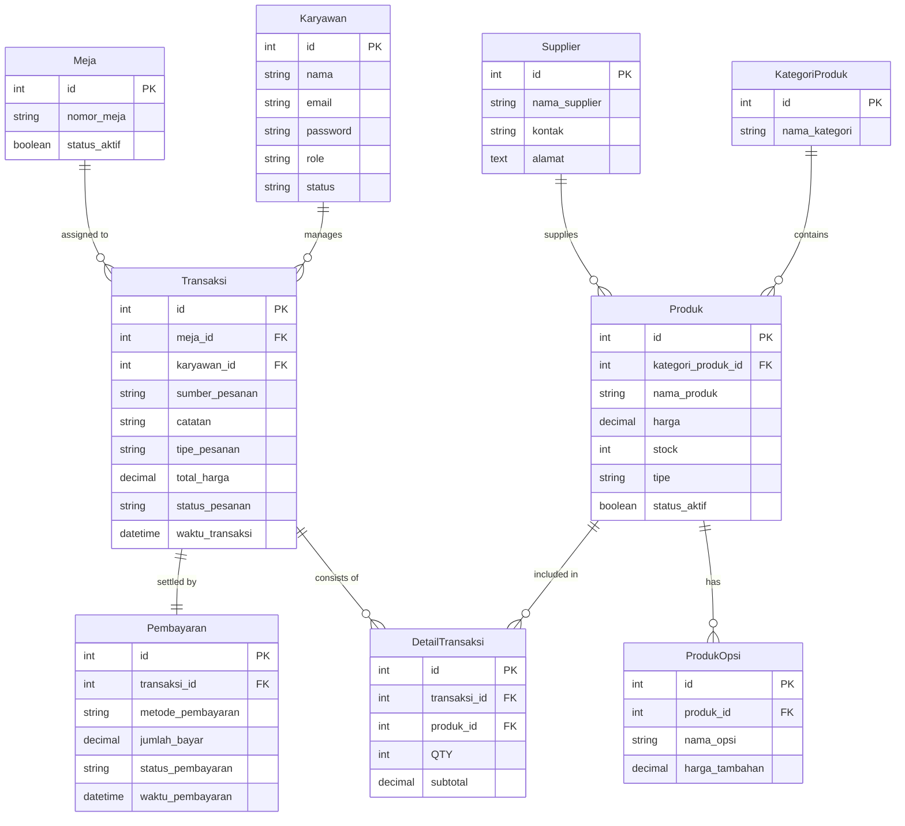

# Entity Relationship Diagram (ERD)

```mermaid
erDiagram
    Karyawan ||--o{ Transaksi : "manages"
    Meja ||--o{ Transaksi : "assigned to"
    KategoriProduk ||--o{ Produk : "contains"
    Produk ||--o{ ProdukOpsi : "has"
    Transaksi ||--o{ DetailTransaksi : "consists of"
    Produk ||--o{ DetailTransaksi : "included in"
    Transaksi ||--|| Pembayaran : "settled by"
    Supplier ||--o{ Produk : "supplies"

    Karyawan {
        int id PK
        string nama
        string email
        string password
        string role
        string status
    }
    Meja {
        int id PK
        string nomor_meja
        boolean status_aktif
    }
    KategoriProduk {
        int id PK
        string nama_kategori
    }
    Produk {
        int id PK
        int kategori_produk_id FK
        string nama_produk
        decimal harga
        int stock
        string tipe
        boolean status_aktif
    }
    ProdukOpsi {
        int id PK
        int produk_id FK
        string nama_opsi
        decimal harga_tambahan
    }
    Transaksi {
        int id PK
        int meja_id FK
        int karyawan_id FK
        string sumber_pesanan
        string catatan
        string tipe_pesanan
        decimal total_harga
        string status_pesanan
        datetime waktu_transaksi
    }
    DetailTransaksi {
        int id PK
        int transaksi_id FK
        int produk_id FK
        int QTY
        decimal subtotal
    }
    Pembayaran {
        int id PK
        int transaksi_id FK
        string metode_pembayaran
        decimal jumlah_bayar
        string status_pembayaran
        datetime waktu_pembayaran
    }
    Supplier {
        int id PK
        string nama_supplier
        string kontak
        text alamat
    }
```
