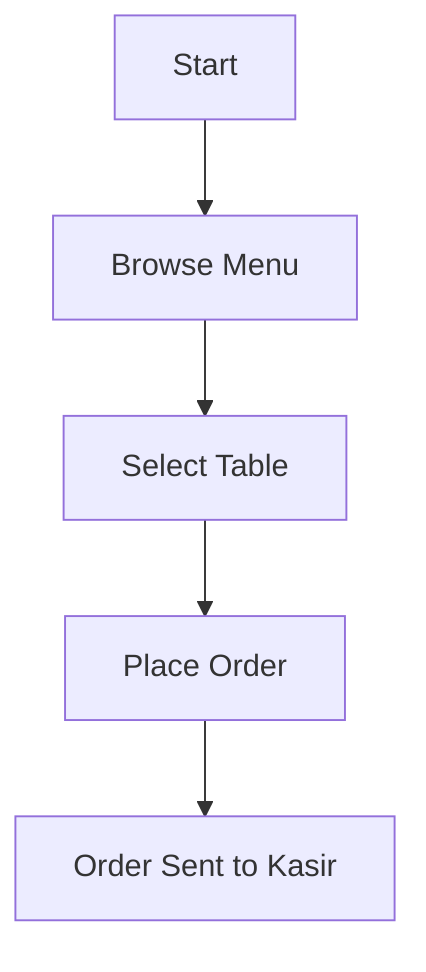
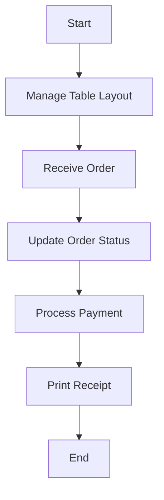
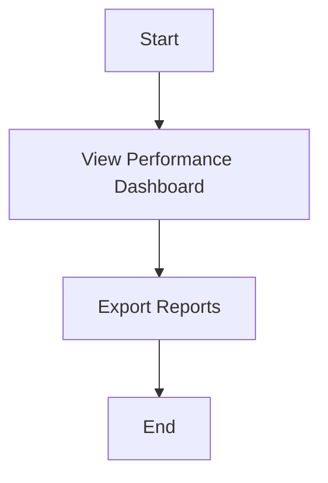
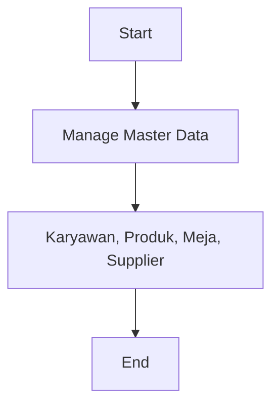

# System Flowcharts (Per Actor)

## Customer Flow

```mermaid
graph TD
    A[Start] --> B[Browse Menu]
    B --> C[Select Table]
    C --> D[Place Order]
    D --> E[Order Sent to Kasir]
```

## Kasir Flow

```mermaid
graph TD
    A[Start] --> B[Manage Table Layout]
    B --> C[Receive Order]
    C --> D[Update Order Status]
    D --> E[Process Payment]
    E --> F[Print Receipt]
    F --> G[End]
```

## Manager Flow

```mermaid
graph TD
    A[Start] --> B[View Performance Dashboard]
    B --> C[Export Reports]
    C --> D[End]
```

## Admin Flow

```mermaid
graph TD
    A[Start] --> B[Manage Master Data]
    B --> C[Karyawan, Produk, Meja, Supplier]
    C --> D[End]
```

