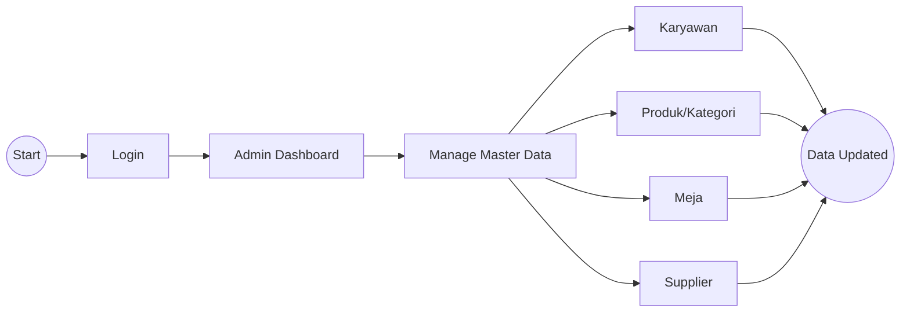

# User Flow - Admin

```mermaid
graph LR
    Start((Start)) --> Login[Login]
    Login --> Dash[Admin Dashboard]
    Dash --> CRUD[Manage Master Data]
    CRUD --> UserMgmt[Karyawan]
    CRUD --> ProductMgmt[Produk/Kategori]
    CRUD --> TableMgmt[Meja]
    CRUD --> SupplierMgmt[Supplier]
    UserMgmt --> Done((Data Updated))
    ProductMgmt --> Done
    TableMgmt --> Done
    SupplierMgmt --> Done
```
