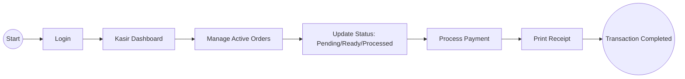

# User Flow - Kasir

```mermaid
graph LR
    Start((Start)) --> Login[Login]
    Login --> Dash[Kasir Dashboard]
    Dash --> ActiveOrders[Manage Active Orders]
    ActiveOrders --> UpdateStatus[Update Status: Pending/Ready/Processed]
    UpdateStatus --> Payment[Process Payment]
    Payment --> Print[Print Receipt]
    Print --> Done((Transaction Completed))
```
